# Bienvenidos

En este curso vas a poder aprender todo lo necesario para poder hacer tus propios proyectos en <a href="https://processing.org/">processing</a> y es un punto de partida para quienes quiera aprender java, espero tu feedback en los videos y tus avances en redes sociales como instagram <***No te olvides de etiquetarme en <a href="https://instagram.com/shinigamy19_art">@Shinigamy19_art</a>***> o en nuestro <a href="https://discord.gg/px9fcpbp3T">servidor de discord</a>.

 

<h3>Dale click a la imagen para empezar este viaje.</h3>

_O mira mas abajo la lista de clases._

 
***No te olvides de suscribirte y dar me gusta.***

# Lista de clases

<ol>

<li>  Como descargar processing || Tutorial Processing
 
    <a href="https://youtu.be/t3wdMqamXbI">
        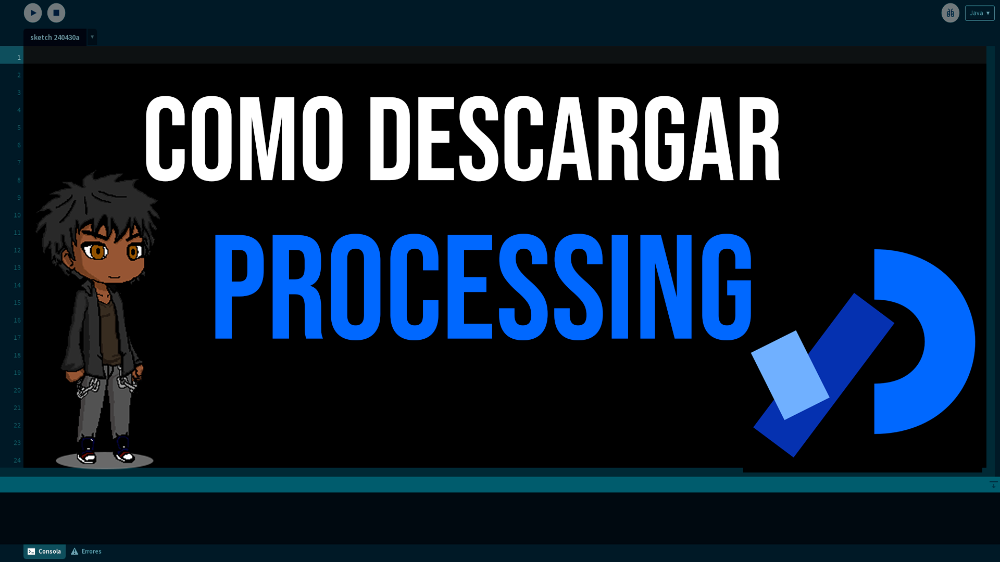
    </a>
</li>

<li>  Estructura, interface y primeros pasos || Tutorial Processing
 
    <a href="https://youtu.be/Y58WvqgFGjs">
        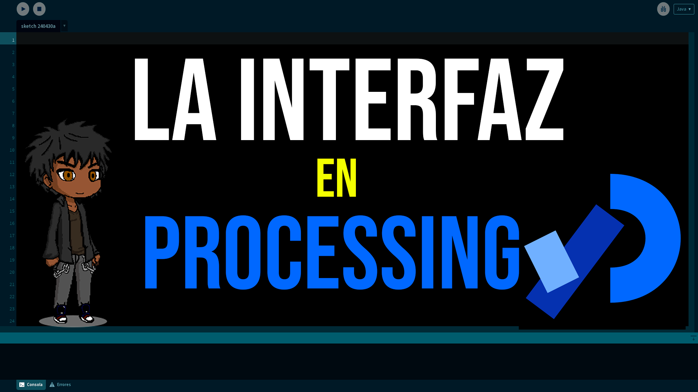
    </a>
</li>

<li>  Como se ponen textos mediante variables || Tutorial Processing
 
    <a href="https://youtu.be/1KpZsCDjiL8">
        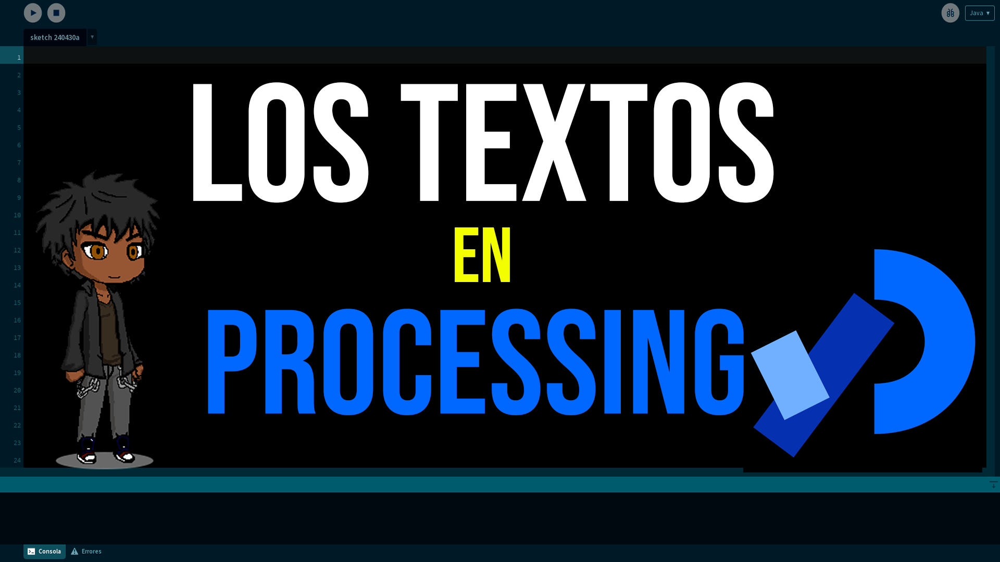
    </a>
</li>

<li>  Haciendo una pokebola con figuras primitivas || Tutorial Processing
 
    <a href="https://youtu.be/qDs_7_1YerE">
        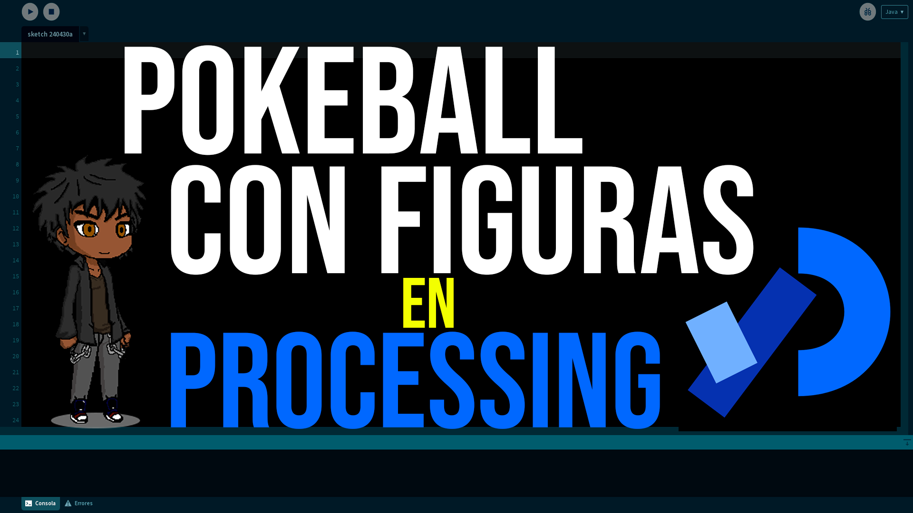
    </a>
</li>

<li>  Creando Objetos y explicación de Conceptos || Tutorial Processing
 
    <a href="https://youtu.be/gQRdkHIJEwE">
        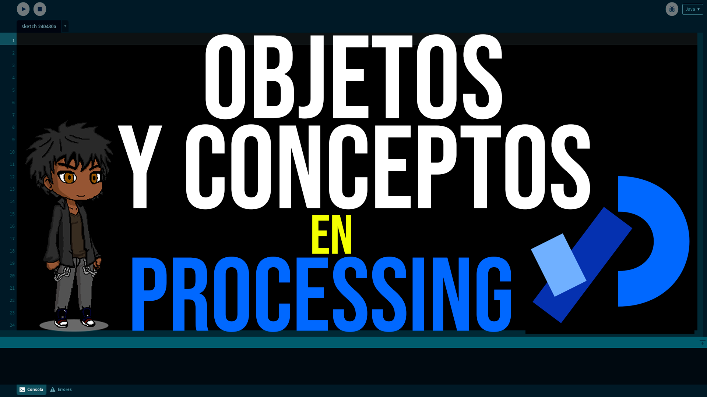
    </a>
</li>

<li>  Creando nuestra interfaz || Tutorial Processing
 
    <a href="https://youtu.be/-CHD7euDleo">
        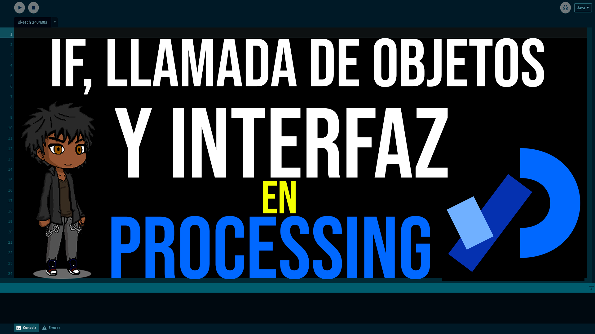
    </a>
</li>

<li>  Lógica de botones || Tutorial Processing
 
    <a href="https://youtu.be/h64oH0vO9KQ">
        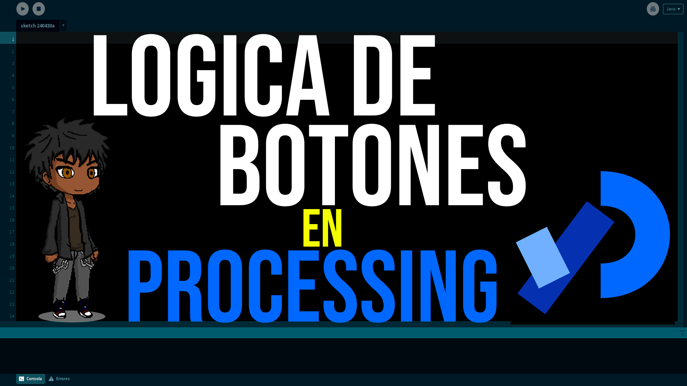
    </a>
</li>

<li>  Boton volver || Tutorial Processing
 
    <a href="https://youtu.be/fzQRIPtb9b4">
        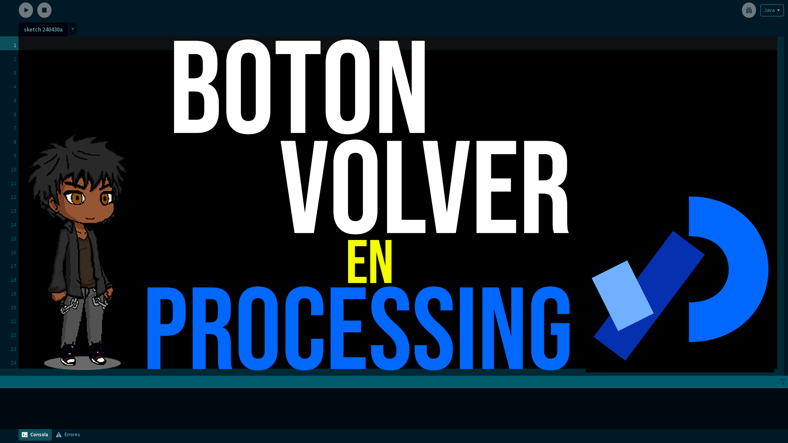
    </a>
</li>

<!--
<li>  Botón circular y controlador de escenas || Tutorial Processing
 
    <a href="https://youtu.be/KyPsGKkgvyc">
        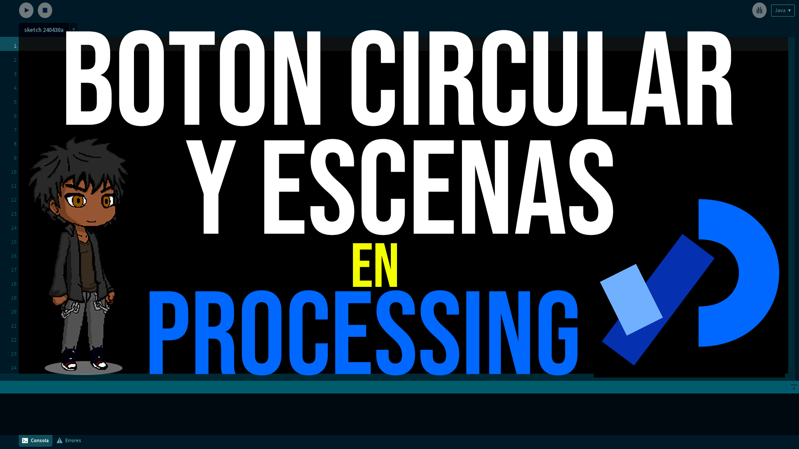
    </a>
</li>

<li>  Imágenes con PImage || Tutorial Processing
 
    <a href="https://youtu.be/irfOAjv3bV0">
        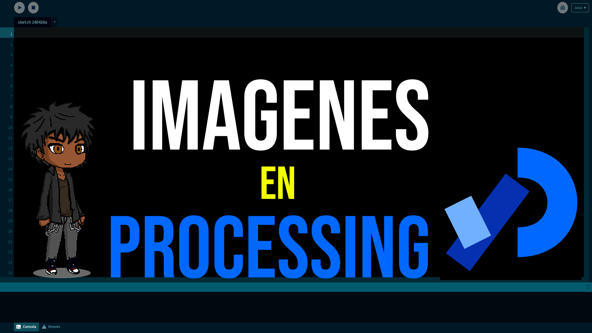
    </a>
</li>

<li>  Fondo con Imágenes || Tutorial Processing
 
    <a href="https://youtu.be/zKCzmwgMtaE">
        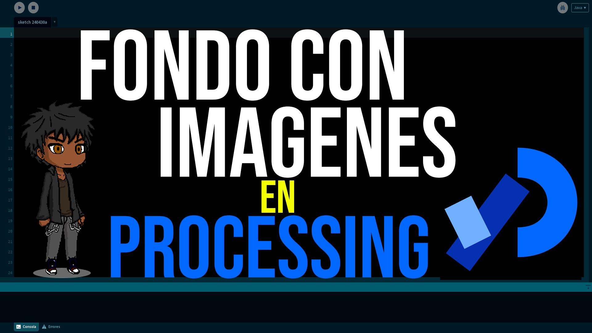
    </a>
</li>

<li>  PGraphics || Tutorial Processing
 
    <a href="https://youtu.be/wNMsiJlGofw">
        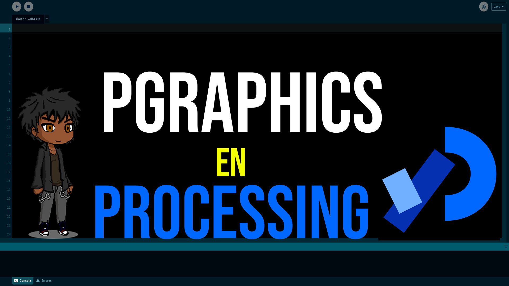
    </a>
</li>

EJEMPLO:
<li>  Como descargar processing || Tutorial Processing
 
    
</li>-->

 
</ol>
<h3 align="center">Mis redes sociales:</h3>

<h3 align="center">Donaciones:</h3>

